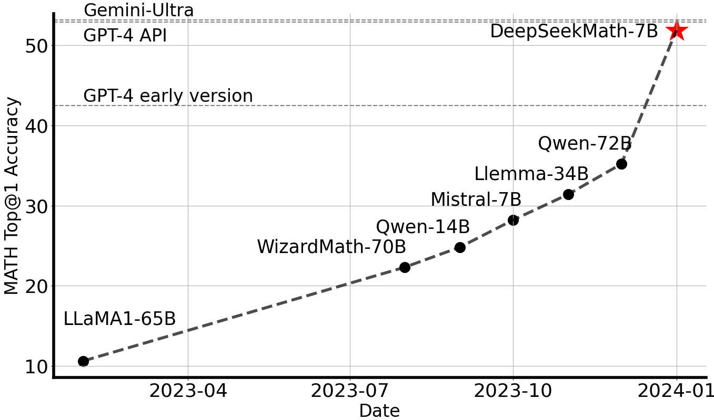
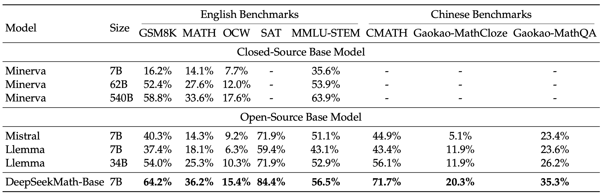
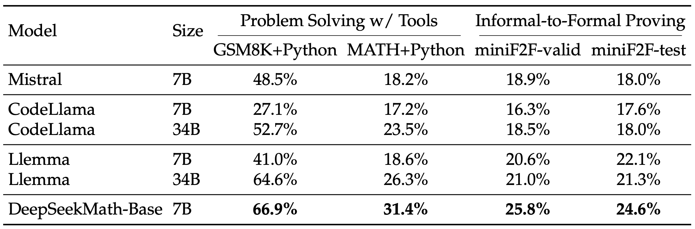
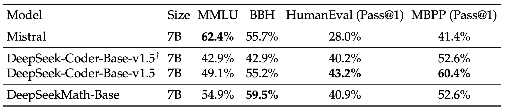
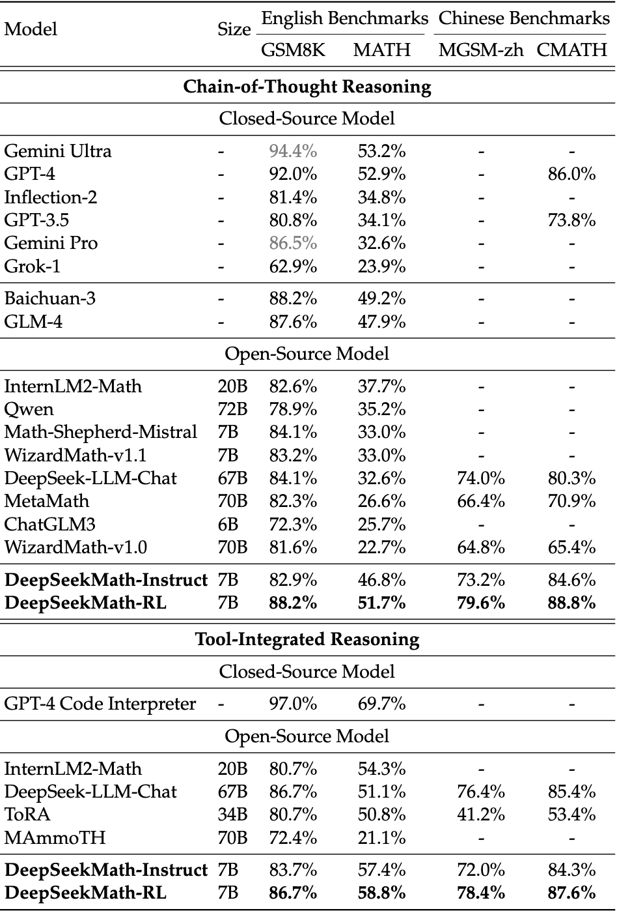
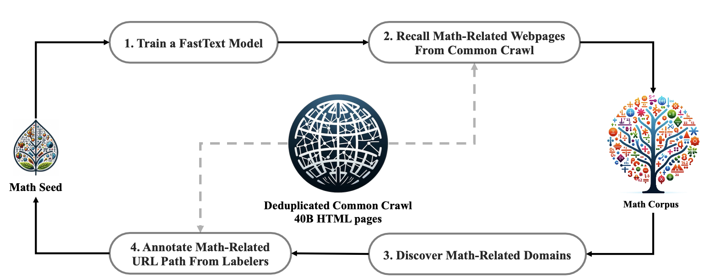

<!-- markdownlint-disable first-line-h1 -->
<!-- markdownlint-disable html -->
<!-- markdownlint-disable no-duplicate-header -->

<div align="center">
  
</div>
<hr>
<div align="center">

  <a href="https://www.deepseek.com/" target="_blank">
    
  </a>
  <a href="https://chat.deepseek.com/" target="_blank">
    
  </a>
  <a href="https://huggingface.co/deepseek-ai" target="_blank">
    
  </a>
   <a href="https://replicate.com/cjwbw/deepseek-math-7b-base" target="_parent"></a> 
</div>

<div align="center">

  <a href="https://discord.gg/Tc7c45Zzu5" target="_blank">
    
  </a>
  <a href="images/qr.jpeg" target="_blank">
    
  </a>
  <a href="https://twitter.com/deepseek_ai" target="_blank">
    
  </a>

</div>

<div align="center">

  <a href="LICENSE-CODE">
    
  </a>
  <a href="LICENSE-MODEL">
    
  </a>
</div>


<p align="center">
  <a href="#4-model-downloads">Model Download</a> |
  <a href="#2-evaluation-results">Evaluation Results</a> |
  <a href="#5-quick-start">Quick Start</a> |
  <a href="#6-license">License</a> |
  <a href="#7-citation">Citation</a>
</p>

<p align="center">
  <a href="https://arxiv.org/pdf/2402.03300.pdf"><b>Paper Link</b>👁️</a>
</p>


## 1. Introduction

DeepSeekMath is initialized with [DeepSeek-Coder-v1.5 7B](https://huggingface.co/deepseek-ai/deepseek-coder-7b-base-v1.5) and continues pre-training on math-related tokens sourced from Common Crawl, together with natural language and code data for 500B tokens. DeepSeekMath 7B has achieved an impressive score of **51.7%** on the competition-level MATH benchmark without relying on external toolkits and voting techniques, approaching the performance level of Gemini-Ultra and GPT-4. For research purposes, we release [checkpoints](#4-model-downloads) of base, instruct, and RL models to the public.

<p align="center">

</p>

## 2. Evaluation Results

### DeepSeekMath-Base 7B

We conduct a comprehensive assessment of the mathematical capabilities of DeepSeekMath-Base 7B, focusing on its ability to produce self-contained mathematical solutions without relying on external tools, solve math problems using tools, and conduct formal theorem proving. Beyond mathematics, we also provide a more general profile of the base model, including its performance of natural language understanding, reasoning, and programming skills.

- **Mathematical problem solving with step-by-step reasoning**

<p align="center">

</p>

- **Mathematical problem solving with tool use**

<p align="center">

</p>

- **Natural Language Understanding, Reasoning, and Code**
<p align="center">

</p>

The evaluation results from the tables above can be summarized as follows:
  - **Superior Mathematical Reasoning:** On the competition-level MATH dataset, DeepSeekMath-Base 7B outperforms existing open-source base models by more than 10% in absolute terms through few-shot chain-of-thought prompting, and also surpasses Minerva 540B.
  - **Strong Tool Use Ability:** Continuing pre-training with DeepSeekCoder-Base-7B-v1.5 enables DeepSeekMath-Base 7B to more effectively solve and prove mathematical problems by writing programs.
  - **Comparable Reasoning and Coding Performance:** DeepSeekMath-Base 7B achieves performance in reasoning and coding that is comparable to that of DeepSeekCoder-Base-7B-v1.5.

### DeepSeekMath-Instruct and -RL  7B

DeepSeekMath-Instruct 7B is a mathematically instructed tuning model derived from DeepSeekMath-Base 7B, while DeepSeekMath-RL 7B is trained on the foundation of DeepSeekMath-Instruct 7B, utilizing our proposed Group Relative Policy Optimization (GRPO) algorithm.

We evaluate mathematical performance both without and with tool use, on 4 quantitative reasoning benchmarks in English and Chinese. As shown in Table, DeepSeekMath-Instruct 7B demonstrates strong performance of step-by-step reasoning, and DeepSeekMath-RL 7B approaches an accuracy of 60% on MATH with tool use, surpassing all existing open-source models.

<p align="center">

</p>


## 3. Data Collection

- Step 1:  Select [OpenWebMath](https://arxiv.org/pdf/2310.06786.pdf), a collection of high-quality mathematical web texts, as our initial seed corpus for training a FastText model.
- Step 2:  Use the FastText model to retrieve mathematical web pages from the deduplicated Common Crawl database.
- Step 3:  Identify potential math-related domains through statistical analysis.
- Step 4:  Manually annotate URLs within these identified domains that are associated with mathematical content.
- Step 5:  Add web pages linked to these annotated URLs, but not yet collected, to the seed corpus. Jump to step 1 until four iterations.


<p align="center">

</p>

After four iterations of data collection, we end up with **35.5M** mathematical web pages, totaling **120B** tokens. 

## 4. Model Downloads

We release the DeepSeekMath 7B, including base, instruct and RL models, to the public. To support a broader and more diverse range of research within both academic and commercial communities. Please **note** that the use of this model is subject to the terms outlined in [License section](#6-license). Commercial usage is permitted under these terms.

### Huggingface

| Model                    | Sequence Length |                           Download                           |
| :----------------------- | :-------------: | :----------------------------------------------------------: |
| DeepSeekMath-Base 7B     |      4096       | 🤗 [HuggingFace](https://huggingface.co/deepseek-ai/deepseek-math-7b-base) |
| DeepSeekMath-Instruct 7B |      4096       | 🤗 [HuggingFace](https://huggingface.co/deepseek-ai/deepseek-math-7b-instruct) |
| DeepSeekMath-RL 7B       |      4096       | 🤗 [HuggingFace](https://huggingface.co/deepseek-ai/deepseek-math-7b-rl) |

## 5. Quick Start

You can directly employ [Huggingface's Transformers](https://github.com/huggingface/transformers) for model inference.

**Text Completion**

```python
import torch
from transformers import AutoTokenizer, AutoModelForCausalLM, GenerationConfig

model_name = "deepseek-ai/deepseek-math-7b-base"
tokenizer = AutoTokenizer.from_pretrained(model_name)
model = AutoModelForCausalLM.from_pretrained(model_name, torch_dtype=torch.bfloat16, device_map="auto")
model.generation_config = GenerationConfig.from_pretrained(model_name)
model.generation_config.pad_token_id = model.generation_config.eos_token_id

text = "The integral of x^2 from 0 to 2 is"
inputs = tokenizer(text, return_tensors="pt")
outputs = model.generate(**inputs.to(model.device), max_new_tokens=100)

result = tokenizer.decode(outputs[0], skip_special_tokens=True)
print(result)
```

**Chat Completion**

```python
import torch
from transformers import AutoTokenizer, AutoModelForCausalLM, GenerationConfig

model_name = "deepseek-ai/deepseek-math-7b-instruct"
tokenizer = AutoTokenizer.from_pretrained(model_name)
model = AutoModelForCausalLM.from_pretrained(model_name, torch_dtype=torch.bfloat16, device_map="auto")
model.generation_config = GenerationConfig.from_pretrained(model_name)
model.generation_config.pad_token_id = model.generation_config.eos_token_id

messages = [
    {"role": "user", "content": "what is the integral of x^2 from 0 to 2?\nPlease reason step by step, and put your final answer within \boxed{}."}
]
input_tensor = tokenizer.apply_chat_template(messages, add_generation_prompt=True, return_tensors="pt")
outputs = model.generate(input_tensor.to(model.device), max_new_tokens=100)

result = tokenizer.decode(outputs[0][input_tensor.shape[1]:], skip_special_tokens=True)
print(result)
```

Avoiding the use of the provided function `apply_chat_template`, you can also interact with our model following the sample template. Note that `messages` should be replaced by your input.

```
User: {messages[0]['content']}

Assistant: {messages[1]['content']}<｜end▁of▁sentence｜>User: {messages[2]['content']}

Assistant:
```

**Note:** By default (`add_special_tokens=True`), our tokenizer automatically adds a `bos_token` (`<｜begin▁of▁sentence｜>`) before the input text. Additionally, since the system prompt is not compatible with this version of our models, we DO NOT RECOMMEND including the system prompt in your input.

❗❗❗ **Please use chain-of-thought prompt to test DeepSeekMath-Instruct and DeepSeekMath-RL:**

- English questions: **{question}\nPlease reason step by step, and put your final answer within \\boxed{}.**

- Chinese questions: **{question}\n请通过逐步推理来解答问题，并把最终答案放置于\\boxed{}中。**


## 6. License
This code repository is licensed under the MIT License. The use of DeepSeekMath models is subject to the Model License. DeepSeekMath supports commercial use.

See the [LICENSE-CODE](LICENSE-CODE) and [LICENSE-MODEL](LICENSE-MODEL) for more details.

## 7. Citation

```
@misc{deepseek-math,
  author = {Zhihong Shao, Peiyi Wang, Qihao Zhu, Runxin Xu, Junxiao Song, Mingchuan Zhang, Y.K. Li, Y. Wu, Daya Guo},
  title = {DeepSeekMath: Pushing the Limits of Mathematical Reasoning in Open Language Models},
  journal = {CoRR},
  volume = {abs/2402.03300},
  year = {2024},
  url = {https://arxiv.org/abs/2402.03300},
}
```


## 8. Contact

If you have any questions, please raise an issue or contact us at [service@deepseek.com](mailto:service@deepseek.com).
